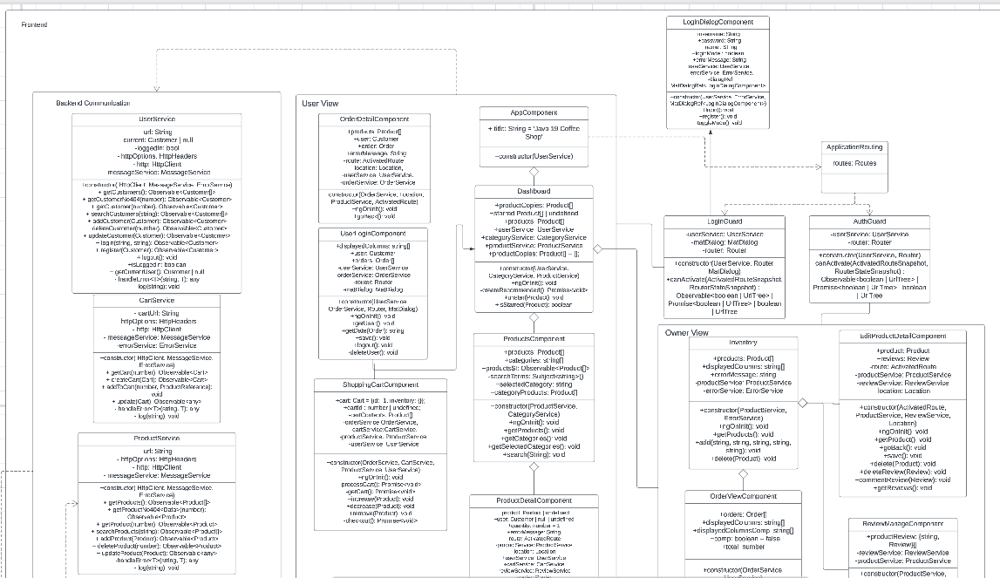
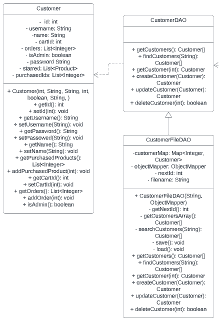
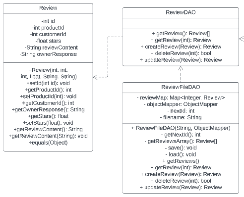
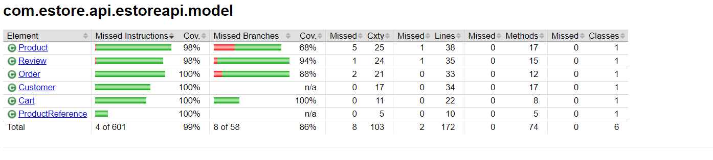
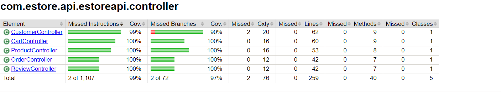

# PROJECT Design Documentation

> _The following template provides the headings for your Design
> Documentation.  As you edit each section make sure you remove these
> commentary 'blockquotes'; the lines that start with a > character
> and appear in the generated PDF in italics._

## Team Information

* Team name: Java 19
* Team members
  * Jessica Eisler
  * Matt London
  * Alex Pross
  * Justin Lin
  * Alexis Sanders

## Executive Summary

This is a summary of the project.

### Purpose

Creating a e-store that sells coffee related products. The customers are the important users and they should be able to effectivley use the store. That is viewing, adding and purchasing products.

### Glossary and Acronyms

| Term | Definition                |
| ---- | ------------------------- |
| SPA  | Single Page               |
| DAO  | Data Access Object        |
| CSS  | Cascading Style Sheets    |
| TS   | Type Script               |
| HTML | Hypertext Markup Language |

Angular material is just an extra set of components to be integrated into the already existing angular components. Has a few cool features that help keep consistent designs. A con is that it could stop being supported by the angular team. This is unlikely as it is backed by Angular. However, the included features expand the possibilities for our development. We will use it to consistently display data across the system. It will also be used to be more organized with our css implementation.

## Requirements

This section describes the features of the application.

> _In this section you do not need to be exhaustive and list every
> story.  Focus on top-level features from the Vision document and
> maybe Epics and critical Stories._

### Definition of MVP

This server will allow users to login with a simple username.
When the username entered is "admin" then the user should be able to edit items within the inventory
Any user that is not an admin should be able to see a list of products, search for a specific product, edit a shopping cart, and checkout.
The data stored within the shopping carts and the inventory should be saved and accessible after logging out and back into an account.

### MVP Features

#### Owner Implementation
The owner is able to add, delete, and edit products in the inventory. Owners can view customer orders. They are able to delete orders
if necessary as well as mark them as complete. 

#### Customer Implementation
The customer is able to view and search all products in the inventory. They are also able to add and remove products from a cart,
which will remain unchanged after logging out and logging back in. The customer can check out which will create an order consisting 
of the products within their cart at the time of checkout and remove these products from the inventory.

### Enhancements

#### Reviews

This feature allows users to review products that they have purchased as well as read reviews from other customers.
The admin is able to respond to a specific review. This response can then be viewed by a user under the review it was a response to. 

#### Recommendations

This feature allows users to favorite products they are interested in and gives them recommendations for other products based on these selections.The owner is also able to recommend products that will be visible to anyone whether or not they are logged into the site.

## Application Domain

This section describes the application domain.

The main interactions within our domain model take place through a customer's interactions with the store. ` `
A **customer** will create an account and then browse the store's **inventory** which will display a collection of **product**. ` `
The user can view existing **review** for each **product**, view **product** sorted by **category** as well as receive a **recommendation** for other products, this assists the user in making purchases. ` `
Once the **customer** has decided to purchase a **product** they can add the item to their **cart** and continue to add more items until they are ready to purchase. ` `
When purchasing, their **cart** will be moved to the **checkout** phase and all items will be marked as purchased and saved in an **order**. ` `
The **customer** can then view the status of their **order**. ` `
The **owner** can mark an **order** as complete, which will notify the **customer** that their order has been processed.

## Architecture and Design

This section describes the application architecture.

### Summary

The following Tiers/Layers model shows a high-level view of the webapp's architecture.

The e-store web application, is built using the Model–View–ViewModel (MVVM) architecture pattern.

The Model stores the application data objects including any functionality to provide persistance.

The View is the client-side SPA built with Angular utilizing HTML, CSS and TypeScript. The ViewModel provides RESTful APIs to the client (View) as well as any logic required to manipulate the data objects from the Model.

Both the ViewModel and Model are built using Java and Spring Framework. Details of the components within these tiers are supplied below.

### Overview of User Interface

This section describes the web interface flow; this is how the user views and interacts
with the e-store application. ` `

When a user first enters the website, they will be presented with the dashboard which displays products recommended by the estore owners. Once the user navigates to the log in page, they have the option to log in or create an account. If they choose to login, but use an invalid user or pass, the website will inform them and deny the login. After logging in or creating an account, if the user goes back to the home page, it will show a welcome "user" screen and display products both recommended from the estore owner and products specific to that user. If the user logs in as a customer, they can click on the products page to view and search through all the products. If they see one they like, they can click on that product, specify how much they want, and click "add to cart" to add it to the cart. Once they've added all they want, they then can navigate over to the cart page to view their shopping cart. This page displays the products in the cart and the amount of each. The user can then press checkout, which will clear their cart, and create a new order. If they navigate back to the login page, they can log out. If the user logs in as an admin, the view will be relatively the same, replacing the cart page with a manage page and adding a review page. On the manage page, the user can view the inventory, and can click on products to make adjustments, such as price, quantity, name, or description. They can also click on the button that leads them to orders, in which they can see all orders in progress or that are completed. They can also mark an order as complete or delete an order. If the user navigates to the review tab, they will see the all of the reviews on the site. They can then respond to any one review or edit a response that was already made. 

### View Tier

> Provide a summary of the View Tier UI of your architecture.
> Describe the types of components in the tier and describe their
> responsibilities.  This should be a narrative description, i.e. it has
> a flow or "story line" that the reader can follow._

When a user loads up the website, the first thing they will see is the user dashboard. From there a user could click on the owner recommended products or navigate to the products page, however if they try to add anything to the cart or interact with any items they will be prompted to log in. They also from the dashboard could navigate to the login page and log in directly from there. If a user is new, they can create an account. If they use a username that exists already, they will be prompted to choose a different name. If they try to log in with an account that doesn't exist, it will tell them invalid login. Once they have created their account or logged in, they have full access to the e-store. They can go to the products page, search, organize products by category, favorite, and select products. Once they've clicked on a product they can add it to the cart, or favorite it from there. They also have the option to review, but that can only be accomplished if they have previously purchased a product, however they can still view other reviews. If they have purchased a product, they can add a star rating and a review, once they press submit it will add the review, and then they can edit it. If an owner has commented on a review it will also show up there. On a review that is theirs, the review will show up in a darker color and an owner's response will be white, otherwise it will show up as a similar color to the background of the e-store. If a user stars/favorites a product, if they navigate back to the dashboard, in addition to owner recommended products, all products they have favorited as well as recommended products based on their favorite will appear. These are all quick links to the products themselves. A user can add products to their cart, and once they have added all they want, they can navigate over to the cart tab. From the cart tab, they can choose to add more or less of a product, remove products, and checkout. Upon checking out, quantities of products will decrease on the products page. The cart will clear and they can continue to shop or log out. On the account page, a user can change their name, username, or password, logout, or they can delete their account. They can also keep track of their previous orders and their status. If it is in progress it will show under "in progress" and if the admin has completed it they will move to "completed". A user can also click on their orders to have a better view of what was purchased. If a user is an admin, they will log in using "admin" as both the user and password. From an admin point of view, they can view the products page and the dashboard, but they cannot purchase or favorite products. They will have an additional page called manage, where they can view orders and the inventory. On the inventory page, an admin can create a new product by inserting a name, price, quantity, description, and category. They can also scroll through all the already created products and click on them, and then they can edit all the features of them. They can change the price, quantity, name, description, or category. They can also select if a product is owner recommended. On the orders tab an owner can view all the orders and complete or delete them. Upon completing them they will move into a "complete orders" tab and upon deleting them, they will just disappear from the e-store. On the reviews page, an admin can view all the reviews and on what product, and they can respond to each by typing it in the box and press submit. They can also edit their response in the same way a customer can edit their review. An admin will not have a user specific order tab on account as they will not have any orders besides ones created by other users. Once the owner has completed all their tasks they can log out just as a customer would. 

**Add To Cart Functionality Sequence Diagram**

**Adding Reviews Sequence Diagrams**

**Checking Out Sequence Diagram**

> _**[Sprint 4]** To adequately show your system, you will need to present the **class diagrams** where relevant in your design. Some additional tips:_
>
> * _Class diagrams only apply to the **ViewModel** and **Model** Tier_
> * _A single class diagram of the entire system will not be effective. You may start with one, but will be need to break it down into smaller sections to account for requirements of each of the Tier static models below._
> * _Correct labeling of relationships with proper notation for the relationship type, multiplicities, and navigation information will be important._
> * _Include other details such as attributes and method signatures that you think are needed to support the level of detail in your discussion._

### ViewModel Tier

> _**[Sprint 4]** Provide a summary of this tier of your architecture. This
> section will follow the same instructions that are given for the View
> Tier above._

> _At appropriate places as part of this narrative provide **one** or more updated and **properly labeled**
> static models (UML class diagrams) with some details such as critical attributes and methods._

### Model Tier

The Model Tier consists of classes that represent our objects within the code. They are leveraged in the DAOs in order to save their data and keep persistence. They are also used by the controllers to process API requests.

#### Product

The product model represents an item that exists within the inventory. It tracks quantity and other information specific to the item.

#### Customer

The customer model allows representing a user and tying them to their cart and all existing orders. It also holds a password to allow login information.

#### Cart

The cart model saves a customer's cart so that it appears on consecutive logins. It stores a collection of products and their quantities. It is cleared once the checkout phase is completed.

#### Order

The order model saves a snapshot of products at the time of purchase as well as computes a total. This allows price changes in the future that will not impact past orders. A customer is tied to an order using the order ID.

#### Reviews

The reviews model saves the customer reviews of a specific product and their rating of the product. A review is tied to a customer using the customer ID. A review is tied to a product using the product ID.

## OO Design Principles

**Information Expert** states the behavior of a class or object should have functions to interpret its own data and not have to pass around its own data to different objects in order to parse the final meaning. Adhering to the principle results in programs that have low coupling and are less complex.
The current ProductFileDAO class has the methods to create, delete, get, update, and search for products because it has the name of the file we are storing the product data in and thus has an easier time accessing the data.

**Controller** represents the user functions. It is a non-user interface that handles the system events. It breaks up the work done by other modules and it controls object activity. It provides a basis to then be performed by other objects within the project.
A controller can be used in our implementations of owner product control, customer shopping cart, custom reviews, customer recommendations, and the controller responsible for logging on to the website itself.

**Low coupling**

Models only call on others when needed. Information is only passed when neccisary to accomplish other tasks. This prevents too much dependency among the modules. A good example is the AuthGuard hooking to the Owner View. This allows it to ensure that only owners can view specific parts of the site and easily allows that access.

**Single responsibility**

Each class has one purpose. To achieve other purposes it calls on other classes. The ts calls upon the DAOs in order to create, update, delete etc. this ensures that the code is not only reusable but also not hard coded and can change with each need. Products is a good example because they are all connected but do not do multiple things. These then get called in the ts files to use the functions.

## Static Code Analysis/Future Design Improvements

> _**[Sprint 4]** With the results from the Static Code Analysis exercise,
> **Identify 3-4** areas within your code that have been flagged by the Static Code
> Analysis Tool (SonarQube) and provide your analysis and recommendations.
> Include any relevant screenshot(s) with each area._

**Future refactoring**
If we had more time to work on this project we would try and implement the following:

- Add images to our products page
  - This would involve working out a method to save an image from a URL or file to the backend to be later retrieved in the frontend
  - We did not implement this feature in our project since we were not allowed to just link to external resources online and ultimately it would have distracted us from the MVP and enhancements
- Add an average review feature
  - This would involve computing the average review and displaying it at the top of the reviews page of a product
- Add a feature so that owner can delete reviews from customers for products.
  - This would involve adding a delete button associated with each review so that the owner can just click delete for a review hw wanted to delete
  - We did not implement this before since we thought giving the owner a blanket delete button may not be good for getting geniuine reviews.
- Add a feature where you can log out from any page on the site sintead of having to navigate to the user profile.
  - This would entail just adding a button to the nav bar that logs you out when clicked.

## Testing

> _This section will provide information about the testing performed
> and the results of the testing._

### Acceptance Testing

Every user story within sprint 2 pasts its acceptance criteria. Each team member was given 2-4 user stories to complete and acceptance criteria for each was determined as a team. During pull requests, team members reviewed the code and the user stories defined and determined whether that user story was implemented successfully before a merge was accepted. The main issues that occurred with acceptance criteria was that for some user stories, the implementation was more difficult, making the criteria harder to reach. However, whenever a teammate had an issue or a question, there was never hesitation to ask for help and all user stories were able to fully meet their acceptance criteria by the end of the sprint.

### Unit Testing and Code Coverage

Coverage is above 95% for all tests. Most anomolies occur with missed branches, especially within product controller
and model. In model, this is due to an equals function, where there is no test to if something is not an instance of product. In controller, the search products fucntion is missed in testing in a few branches. In CartDAO, the tests states of if the cart is null is not reached, so an error occurs there in several test functions. In OrderDAO, the updateOrder function does not get fully tested as the order does not return null. In CustomerController, the create customer function is missed in several branches. Overall, the coverage is near 100% in all categories.

Our strategy was to use Jacoco to see the code coverage and worked to get as close to 100% coverage as possible.
