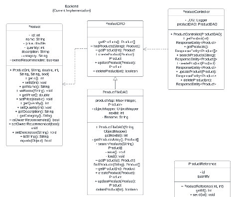
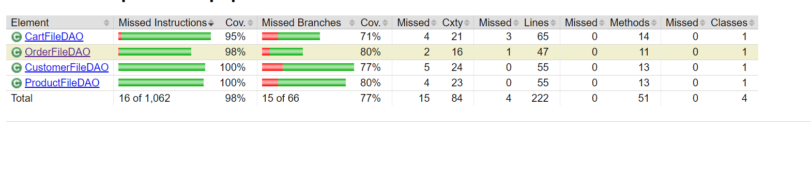
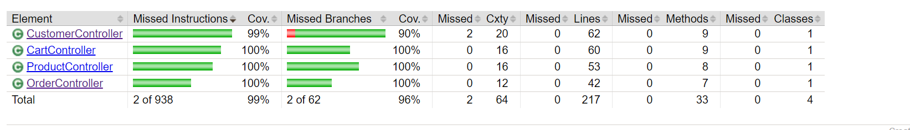

# PROJECT Design Documentation

> _The following template provides the headings for your Design
> Documentation.  As you edit each section make sure you remove these
> commentary 'blockquotes'; the lines that start with a > character
> and appear in the generated PDF in italics._

## Team Information

* Team name: Java 19
* Team members
  * Jessica Eisler
  * Matt London
  * Alex Pross
  * Justin Lin
  * Alexis Sanders

## Executive Summary

This is a summary of the project.

### Purpose

Creating a e-store that sells coffee related products. The customers are the important users and they should be able to effectivley use the store. That is viewing, adding and purchasing products.

### Glossary and Acronyms

| Term | Definition                |
| ---- | ------------------------- |
| SPA  | Single Page               |
| DAO  | Data Access Object        |
| CSS  | Cascading Style Sheets    |
| TS   | Type Script               |
| HTML | Hypertext Markup Language |

Angular material is just an extra set of components to be integrated into the already existing angular components. Has a few cool features that help keep consistent designs. A con is that it could stop being supported by the angular team. This is unlikely as it is backed by Angular. However, the included features expand the possibilities for our development. We will use it to consistently display data across the system. It will also be used to be more organized with our css implementation.

## Requirements

This section describes the features of the application.

> _In this section you do not need to be exhaustive and list every
> story.  Focus on top-level features from the Vision document and
> maybe Epics and critical Stories._

### Definition of MVP

This server will allow users to login with a simple username.
When the username entered is "admin" then the user should be able to edit items within the inventory
Any user that is not an admin should be able to see a list of products, search for a specific product, edit a shopping cart, and checkout.
The data stored within the shopping carts and the inventory should be saved and accessible after logging out and back into an account.

### MVP Features

> _**[Sprint 4]** Provide a list of top-level Epics and/or Stories of the MVP._

### Enhancements

> _**[Sprint 4]** Describe what enhancements you have implemented for the project._

## Application Domain

This section describes the application domain.

The main interactions within our domain model take place through a customer's interactions with the store. ` `
A **customer** will create an account and then browse the store's **inventory** which will display a collection of **product**. ` `
The user can view existing **review** for each **product**, view **product** sorted by **category** as well as receive a **recommendation** for other products, this assists the user in making purchases. ` `
Once the **customer** has decided to purchase a **product** they can add the item to their **cart** and continue to add more items until they are ready to purchase. ` `
When purchasing, their **cart** will be moved to the **checkout** phase and all items will be marked as purchased and saved in an **order**. ` `
The **customer** can then view the status of their **order**. ` `
The **owner** can mark an **order** as complete, which will notify the **customer** that their order has been processed.

## Architecture and Design

This section describes the application architecture.

### Summary

The following Tiers/Layers model shows a high-level view of the webapp's architecture.

The e-store web application, is built using the Model–View–ViewModel (MVVM) architecture pattern.

The Model stores the application data objects including any functionality to provide persistance.

The View is the client-side SPA built with Angular utilizing HTML, CSS and TypeScript. The ViewModel provides RESTful APIs to the client (View) as well as any logic required to manipulate the data objects from the Model.

Both the ViewModel and Model are built using Java and Spring Framework. Details of the components within these tiers are supplied below.

### Overview of User Interface

This section describes the web interface flow; this is how the user views and interacts
with the e-store application. ` `

When a user first enters the website, they will be prompted with a screen asking them to login or create an account.
Once the user navigates to the log in page, they have the option to log in or create an account. If they choose to login, but use an invalid user or pass, the website will inform them and deny the login. After logging in or creating, if the user goes back to the home page, it will show a welcome "user" screen. If the user logs in as a customer, they can click on the products page to view and search through all the products. If they see one they like, they can click on that product, specify how much they want, and click "buy" to add it to the cart. Once they've added all they want, they then can navigate over to the cart page to view their shopping cart. This page displayes the products in the cart and the amount of each. The user can then press checkout, which will clear their cart. If they navigate back to the login page, they can log out. If the user logs in as an admin, the view will be relatively the same, with the addition of the manage page. On the manage page, the user can view the inventory, and can click on products to make adjustments, such as price, quantity, name, or description. They can also click on the button that leads them to orders, in which they can see all orders in progress or that are completed.

### View Tier

> _**[Sprint 4]** Provide a summary of the View Tier UI of your architecture.
> Describe the types of components in the tier and describe their
> responsibilities.  This should be a narrative description, i.e. it has
> a flow or "story line" that the reader can follow._

> _**[Sprint 4]** You must  provide at least **2 sequence diagrams** as is relevant to a particular aspects
> of the design that you are describing.  For example, in e-store you might create a
> sequence diagram of a customer searching for an item and adding to their cart.
> As these can span multiple tiers, be sure to include an relevant HTTP requests from the client-side to the server-side
> to help illustrate the end-to-end flow._

> _**[Sprint 4]** To adequately show your system, you will need to present the **class diagrams** where relevant in your design. Some additional tips:_
>
> * _Class diagrams only apply to the **ViewModel** and **Model** Tier_
> * _A single class diagram of the entire system will not be effective. You may start with one, but will be need to break it down into smaller sections to account for requirements of each of the Tier static models below._
> * _Correct labeling of relationships with proper notation for the relationship type, multiplicities, and navigation information will be important._
> * _Include other details such as attributes and method signatures that you think are needed to support the level of detail in your discussion._

### ViewModel Tier

> _**[Sprint 4]** Provide a summary of this tier of your architecture. This
> section will follow the same instructions that are given for the View
> Tier above._

> _At appropriate places as part of this narrative provide **one** or more updated and **properly labeled**
> static models (UML class diagrams) with some details such as critical attributes and methods._

### Model Tier

The Model Tier consists of classes that represent our objects within the code. They are leveraged in the DAOs in order to save their data and keep persistence. They are also used by the controllers to process API requests.

#### Product

The product model represents an item that exists within the inventory. It tracks quantity and other information specific to the item.

#### Customer

The customer model allows representing a user and tying them to their cart and all existing orders. It also holds a password to allow login information.

#### Cart

The cart model saves a customer's cart so that it appears on consecutive logins. It stores a collection of products and their quantities. It is cleared once the checkout phase is completed.

#### Order

The order model saves a snapshot of products at the time of purchase as well as computes a total. This allows price changes in the future that will not impact past orders. A customer is tied to an order using the order ID.

## OO Design Principles

**Information Expert** states the behavior of a class or object should have functions to interpret its own data and not have to pass around its own data to different objects in order to parse the final meaning. Adhering to the principle results in programs that have low coupling and are less complex.
The current ProductFileDAO class has the methods to create, delete, get, update, and search for products because it has the name of the file we are storing the product data in and thus has an easier time accessing the data.

**Controller** represents the user functions. It is a non-user interface that handles the system events. It breaks up the work done by other modules and it controls object activity. It provides a basis to then be performed by other objects within the project.
A controller can be used in our implementations of owner product control, customer shopping cart, custom reviews, customer recommendations, and the controller responsible for logging on to the website itself.

**Low coupling**

Models only call on others when needed. Information is only passed when neccisary to accomplish other tasks. This prevents too much dependency among the modules. A good example is the AuthGuard hooking to the Owner View. This allows it to ensure that only owners can view specific parts of the site and easily allows that access.

**Single responsibility**

Each class has one purpose. To achieve other purposes it calls on other classes. The ts calls upon the DAOs in order to create, update, delete etc. this ensures that the code is not only reusable but also not hard coded and can change with each need. Products is a good example because they are all connected but do not do multiple things. These then get called in the ts files to use the functions.

> _**[Sprint 3 & 4]** OO Design Principles should span across **all tiers.**_

## Static Code Analysis/Future Design Improvements

> _**[Sprint 4]** With the results from the Static Code Analysis exercise,
> **Identify 3-4** areas within your code that have been flagged by the Static Code
> Analysis Tool (SonarQube) and provide your analysis and recommendations.
> Include any relevant screenshot(s) with each area._

> _**[Sprint 4]** Discuss **future** refactoring and other design improvements your team would explore if the team had additional time._

## Testing

> _This section will provide information about the testing performed
> and the results of the testing._

### Acceptance Testing

Every user story within sprint 2 pasts its acceptance criteria. Each team member was given 2-4 user stories to complete and acceptance criteria for each was determined as a team. During pull requests, team members reviewed the code and the user stories defined and determined whether that user story was implemented successfully before a merge was accepted. The main issues that occurred with acceptance criteria was that for some user stories, the implementation was more difficult, making the criteria harder to reach. However, whenever a teammate had an issue or a question, there was never hesitation to ask for help and all user stories were able to fully meet their acceptance criteria by the end of the sprint.

### Unit Testing and Code Coverage

> _**[Sprint 4]** Discuss your unit testing strategy. Report on the code coverage
> achieved from unit testing of the code base. Discuss the team's
> coverage targets, why you selected those values, and how well your
> code coverage met your targets._

Coverage is above 95% for all tests. Most anomolies occur with missed branches, especially within product controller
and model. In model, this is due to an equals function, where there is no test to if something is not an instance of product. In controller, the search products fucntion is missed in testing in a few branches. In CartDAO, the tests states of if the cart is null is not reached, so an error occurs there in several test functions. In OrderDAO, the updateOrder function does not get fully tested as the order does not return null. In CustomerController, the create customer function is missed in several branches. Overall, the coverage is near 100% in all categories.
